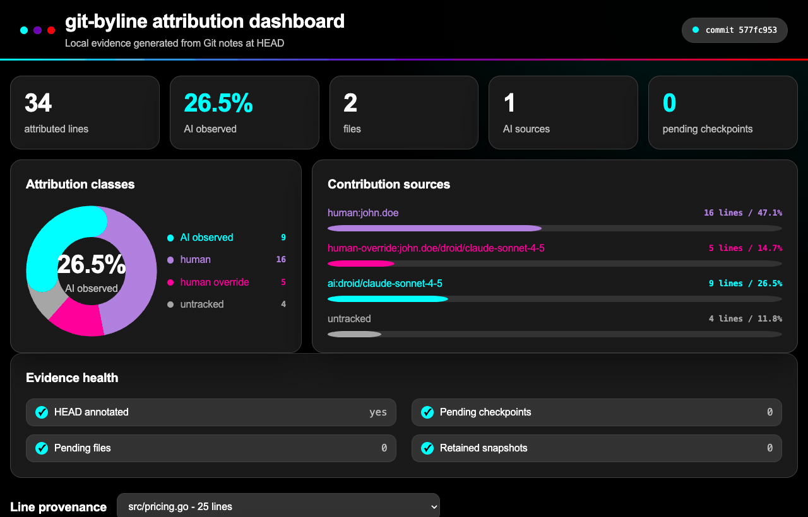
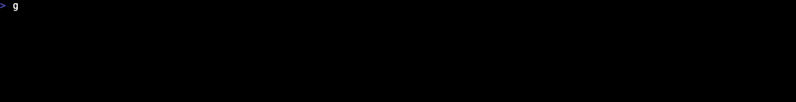
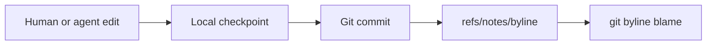

# git-byline

**Line-level proof of who wrote your code - which person, which agent, which
model - without sending anything anywhere.**

[](https://github.com/comarch/git-byline/actions/workflows/ci.yml)
[](https://github.com/comarch/git-byline/security.yml)
[](https://codecov.io/gh/comarch/git-byline)
[](go.mod)
[](promptscript.yaml)
[](LICENSE)
[](docs/SECURITY_MODEL.md)

Git records who committed a line. It cannot tell whether that line came from a
person, an AI agent, or older history. git-byline adds that missing layer: one
pure Go binary, local hooks that observe edits as they happen, and deterministic
provenance stored in Git notes.

## Quick start

One command. macOS and Linux:

```sh
curl -fsSL --proto '=https' --proto-redir '=https' --tlsv1.2 \
  https://raw.githubusercontent.com/comarch/git-byline/main/install.sh | bash
```

Windows PowerShell:

```powershell
irm https://raw.githubusercontent.com/comarch/git-byline/main/install.ps1 | iex
```

The installer verifies the release archive checksum and the binary version,
then detects the coding agents on your machine. Factory and Claude Code get a
user-level hook that covers every repository. For the other supported agents
it prints the one command that adds their hook to a project. Run it inside a
repository and the Git hooks are installed there too, so the next commit is
already attributed:

```sh
git commit -m "feat: add example"
git byline blame src/example.go
```

Nothing leaves your machine. No account, no daemon, no telemetry, and the
binary opens no network connection.

Prefer your agent's own package manager, or no agent at all? See
[step 1](#step-1-pick-an-install-path). Not convinced yet? Keep reading.


Four views, two of them close-ups: line attribution, who wrote what, the
range aggregate, and the policy gate with its exit code. Real terminal
recording, no mock output, no retouching.

The same evidence renders as one self-contained HTML file, with no CDN, font,
image, script, or API loaded:



```sh
git byline dashboard                        # current HEAD, with source lines
git byline dashboard --range HEAD~10..HEAD  # trend and breakdowns
```

> **Observed provenance, not AI detection.** git-byline records agent edits when
> they happen. It does not guess from code style, tokens, or statistical
> classifiers. When evidence is missing, the answer is `untracked`, never a
> confident guess.

## Contents

**Start**

- [Quick start](#quick-start)

**Understand**

- [What Git cannot answer](#what-git-cannot-answer)
- [Four states per line](#four-states-per-line)
- [Why engineering leaders deploy it](#why-engineering-leaders-deploy-it)

**See it work**

- [Who wrote what, per person and per agent](#who-wrote-what-per-person-and-per-agent)
- [A gate, not a dashboard nobody opens](#a-gate-not-a-dashboard-nobody-opens)
- [Local dashboard, no hosted service](#local-dashboard-no-hosted-service)

**Set up**

- [Requirements](#requirements)
- [Step 1: pick an install path](#step-1-pick-an-install-path)
  - [Path A: agent package](#path-a-agent-package)
  - [Path A: agent templates](#path-a-agent-templates)
  - [Path B: release installer](#path-b-release-installer)
  - [Path C: Go toolchain or source](#path-c-go-toolchain-or-source)
- [Step 2: activate hooks](#step-2-activate-hooks)
- [Step 3: work normally](#step-3-work-normally)
- [Step 4: inspect committed provenance](#step-4-inspect-committed-provenance)
- [Uninstall](#uninstall)

**Reference**

- [Commands](#commands)
- [How attribution works](#how-attribution-works)
- [Capabilities](#capabilities)
- [How it compares](#how-it-compares)
- [Local data and privacy](#local-data-and-privacy)
- [Limitations](#limitations)
- [Troubleshooting](#troubleshooting)
- [Documentation](#documentation)
- [Development](#development)
- [Support and security](#support-and-security)
- [License](#license)

## What Git cannot answer

| Question | `git blame` | git-byline |
| --- | --- | --- |
| Which commit touched this line? | yes | yes |
| Was this line written by a person or an agent? | no | yes, per line |
| Which person wrote it? | commit author, whole commit | per line, `human:john.doe` |
| Which agent and model produced it? | no | yes, with session and timestamp |
| Did a person rewrite agent output? | no | yes, `human-override` keeps the AI origin |
| What is genuinely unknown? | nothing is marked unknown | `untracked`, never guessed |

## Four states per line

| State | Meaning | Carries |
| --- | --- | --- |
| `human` | No supported agent checkpoint claimed the final transition | line range, person identity |
| `ai` | A supported hook observed an agent edit | agent, model, session, timestamps |
| `human-override` | A person replaced AI output; the AI origin stays visible | person identity, agent, model, session, timestamps |
| `untracked` | Evidence missing or ambiguous - never guessed | line range |

Human identity comes from the commit author of the commit that introduced the
line, reduced to the email local part, so anyone can reproduce it with
`git log`. Lines reprojected from older notes keep the identity those notes
recorded, so a commit never claims work it did not introduce.

## Why engineering leaders deploy it

| Need | What git-byline provides |
| --- | --- |
| Answer "how much of this release is AI-written" with evidence | Deterministic line counts per class, per person, per agent, per model, per session, over any revision range |
| Keep review effort where the risk is | Reviewers jump straight to agent-edited ranges instead of treating a mixed commit as one opaque change |
| Enforce a policy instead of a guideline | `git byline check` fails a build on an AI or untracked share limit, with a stable exit code and JSON output |
| Produce something an auditor accepts | Machine-readable disclosure documents plus `verify --deep`, which proves the artifact against the actual blobs |
| Work in a regulated or air-gapped estate | No cloud, account, daemon, telemetry, or update check. The binary opens no network connection at all |
| Avoid another vendor in the data path | Prompts and transcripts are never stored. Metadata travels only through Git, to the remote you already trust |
| Survive real Git workflows | Rebase, amend, cherry-pick, reset, branch switch, stash, squash merges, and forge merges are covered |

## Who wrote what, per person and per agent


`git byline stats` aggregates notes over any revision range without reading a
single blob: author classes, agents, models, people, sessions, files, and
commits, in deterministic order. The `authors` section answers the question
management actually asks, and the JSON output feeds your own tooling.

## A gate, not a dashboard nobody opens



```sh
git byline check --max-ai-percent 30        # exit 1 on violation, 0 on success
git byline check --max-untracked-percent 5 --require-note --json
git byline verify --deep                    # prove notes against real blobs
git byline disclosure --format cyclonedx --output sbom.json
```

Flags only: no configuration file, no new format to maintain. `check` is the
gate, `verify` is the proof, and `disclosure` is the artifact. Together they
are the pair an auditor asks for: the document, and the means to check it.

Disclosure writes a versioned native JSON document, CycloneDX 1.6 JSON, or
SPDX 3.0.1 JSON-LD using the AI profile. AI share is defined consistently as
AI lines plus `human-override` lines over total lines. It is machine-readable
input for an AI content disclosure process, not a compliance certificate.

## Local dashboard, no hosted service

Shown [at the top](#git-byline). `git byline dashboard` renders one
self-contained HTML file: attribution classes, contribution sources, evidence
health, and per-line provenance with source lines. No CDN, font, image,
script, or API is loaded. Range mode aggregates a whole history slice with a
commit trend and bounded breakdowns, including lines per person, without
source lines.

```sh
git byline dashboard                              # current HEAD, source lines
git byline dashboard --range HEAD~10..HEAD        # trend and breakdowns
git byline dashboard --output report.html src/example.go
```

Default output is a private temporary file. Existing files are never
replaced. The report carries no fonts and no images, so it opens the same way
offline in five years. Palette, type, and accessibility decisions are
documented in [design](docs/DESIGN.md).

## Requirements

| Component | Supported |
| --- | --- |
| Git | 2.31 or newer |
| Build toolchain | Go 1.24 or newer, only for Path C |
| Operating systems | Linux, macOS, Windows |
| Architectures | amd64, arm64 |
| Text files | Valid UTF-8 without NUL bytes |

Git 2.31 is the minimum because git-byline uses absolute Git path discovery.
CI tests Go 1.24 and current stable Go on Linux, plus Go 1.24 on macOS and
Windows. See [compatibility details](docs/COMPATIBILITY.md).

## Step 1: pick an install path

| Path | For | Installs the binary | Installs hooks |
| --- | --- | :---: | :---: |
| [A: agent package](#path-a-agent-package) | Factory, Claude Code, Gemini CLI | yes | yes, automatically |
| [A: agent templates](#path-a-agent-templates) | Copilot, VS Code, Cursor, Codex, Windsurf, Grok | yes | yes, after two files are copied |
| [B: release installer](#path-b-release-installer) | no agent, or a CI runner | yes | no, do [step 2](#step-2-activate-hooks) |
| [C: Go or source](#path-c-go-toolchain-or-source) | contributors and air-gapped builds | you build it | no, do [step 2](#step-2-activate-hooks) |

Pick one path. Path A installs hooks for you, so it skips step 2. Paths B and
C need [step 2](#step-2-activate-hooks).

### Path A: agent package

Three agents install git-byline as a package:

| Agent | Install |
| --- | --- |
| Factory | `droid plugin marketplace add comarch/git-byline` |
| Claude Code | `/plugin marketplace add comarch/git-byline` |
| Gemini CLI | `gemini extensions install https://github.com/comarch/git-byline` |

Factory also needs `droid plugin install git-byline@git-byline --scope user`,
Claude Code `/plugin install git-byline@git-byline`, and Gemini CLI a
restart. Then run:

```text
/git-byline-setup
```

That command does the whole setup: it installs the verified release binary for
your operating system, installs the agent hook and the Git hooks for the
current repository, reports what attribution notes will contain, and runs
`git byline status`. **Skip step 2 and continue at
[step 3](#step-3-work-normally).**

Two things to finish by hand afterwards:

- add the reported install directory to `PATH`,
- restart running agents so they pick up the new `PATH`.

Run `/git-byline-setup` again in any other repository to install its Git
hooks. Ask for `--local-notes` if you want
[note sharing disabled](#local-data-and-privacy).

### Path A: agent templates

The other six supported agents have no package manager that installs from a
repository. Two checked-in files give them the same result: a setup command,
so the agent gains `/git-byline-setup`, and a hook file, so the agent reports
its edits.

| Agent | Setup command goes to | Hook file goes to |
| --- | --- | --- |
| GitHub Copilot | `.github/prompts/` | `.github/hooks/promptscript.json` |
| VS Code Agent | `.github/prompts/` | `.github/hooks/promptscript-vscode.json` |
| Cursor | `.cursor/commands/` | `.cursor/hooks.json` |
| Codex | `$HOME/.codex/prompts/` | `.codex/hooks.json` |
| Windsurf | `.windsurf/workflows/` | `.windsurf/hooks.json` |
| Grok | the prompt directory your build reads | `.grok/hooks/promptscript.json` |

Copy the setup command, for example for Cursor:

```sh
curl -fsSL --proto '=https' --proto-redir '=https' --tlsv1.2 \
  -o .cursor/commands/git-byline-setup.md --create-dirs \
  https://raw.githubusercontent.com/comarch/git-byline/main/marketplace/harness/cursor/git-byline-setup.md
```

Then run `/git-byline-setup`, which installs the binary, the Git hooks, and
the hook file. Every template and its copy target is listed in
[agent setup templates](marketplace/harness/README.md); the per-agent detail
is in [installation](docs/INSTALL.md).

Without the agent hook, git-byline still annotates commits, but agent edits
arrive as plain `human` lines rather than `ai` lines, because nothing
observed them.

### Path B: release installer

Linux and macOS:

```sh
curl -fsSL --proto '=https' --proto-redir '=https' --tlsv1.2 \
  https://raw.githubusercontent.com/comarch/git-byline/main/install.sh | bash
```

Windows PowerShell:

```powershell
irm https://raw.githubusercontent.com/comarch/git-byline/main/install.ps1 | iex
```

Both installers verify the release archive checksum and the binary version
before installation. The one-liners execute a mutable installer from protected
`main`; checksum-first, reviewed-script, and manual archive methods are
documented in [installation](docs/INSTALL.md).

Then continue at [step 2](#step-2-activate-hooks).

### Path C: Go toolchain or source

```sh
git clone https://github.com/comarch/git-byline.git
cd git-byline
CGO_ENABLED=0 go build -trimpath -o git-byline ./cmd/git-byline
```

Put the binary on `PATH` as `git-byline` so `git byline` resolves as a Git
subcommand. Then continue at [step 2](#step-2-activate-hooks).

## Step 2: activate hooks

Skip this step if you used path A. Hooks are already installed.

```sh
git byline install-hooks --agent droid --git --user
git byline status
```

Use `--agent claude` for Claude Code or `--agent all` for both. `--user`
stores the agent hook under your home directory with the current executable
path. Use `--project` to create a portable, reviewable project configuration
that resolves `git-byline` through `PATH`. User-scoped agent hooks quietly
ignore events outside a Git worktree.

`--git` installs `post-commit` attribution and `pre-push` note sharing.
Ordinary pushes then publish line ranges, paths, agent and model names,
human identity tokens, session identifiers, and timestamps to the same
remote. Use `--local-notes` to install attribution without automatic note
sharing:

```sh
git byline install-hooks --agent droid --git --user --local-notes
```

Repeat this step once per repository. Agent hooks installed with `--user`
apply everywhere; Git hooks are per repository.

## Step 3: work normally

Use your agent, edit by hand, stage selected changes, and commit:

```sh
git add src/example.go
git commit -m "feat: add example"
```

The `post-commit` hook annotates the commit. Nothing else is required.

## Step 4: inspect committed provenance

```sh
git byline blame src/example.go
```

Example output:

```text
human:john.doe                                    1 | package example
ai:droid/model-name                               2 | func AddedByAgent() {}
human-override:john.doe/droid/model-name          3 | // Agent line a person rewrote.
untracked                                         4 | // Predates attribution history.
```

The label column is sized from the widest label, so alignment holds. Color is
used on a terminal and dropped for pipes, `NO_COLOR`, and `--color=never`.

Machine-readable output:

```sh
git byline blame --json src/example.go
git byline status --json
git byline stats --json HEAD~10..HEAD
```

## Uninstall

Remove only hooks managed by git-byline:

```sh
git byline uninstall --agent droid --git --user
```

Use `--agent none --git` to manage only the Git hook.

Backups of changed agent and Git hook configuration use the
`.git-byline.bak` suffix. Existing shell hooks and unrelated agent
configuration are preserved. Non-shell hooks, symlinked paths, external
`core.hooksPath` locations, and other non-regular files are refused.

Uninstalling hooks stops new attribution. It does not delete existing notes.

## Commands

Seventeen commands, one binary:

| Capability | Commands |
| --- | --- |
| Track | `checkpoint`, `annotate`, `rewrite`, `install-hooks`, `uninstall` |
| Inspect | `blame`, `status`, `stats`, `dashboard`, `verify` |
| Enforce | `check`, `disclosure` |
| Interoperate | `export`, `import`, `ci` |
| Meta | `version`, `help` |

| Command | Purpose |
| --- | --- |
| `checkpoint <preset>` | Record a human or AI edit snapshot from hook input |
| `annotate` | Replay pending snapshots and annotate `HEAD` |
| `blame [--json] [--color=auto\|always\|never] <file>` | Show line attribution for a file at `HEAD` (file resolves from the working directory first, like `git blame`) |
| `status [--json]` | Show checkpoint, pending, and annotation state |
| `dashboard [--range <rev-range>] [--repo] [--output FILE] [file]` | Generate a self-contained local HTML report |
| `stats [<rev-range>] [--json]` | Aggregate attribution statistics without reading blobs |
| `verify [<rev-range>] [--deep] [--json]` | Verify attribution notes and blob-pinned ranges |
| `check [<rev-range>] [--max-ai-percent N] [--max-untracked-percent N] [--require-note] [--json]` | Check attribution policy limits |
| `disclosure [--range <rev-range>] [--format json\|spdx\|cyclonedx] [--output FILE]` | Write machine-readable AI content disclosure input |
| `rewrite --mode MODE --hook-input stdin` | Preserve attribution across rewrites, resets, switches, and stash transitions |
| `export --format gitai\|agent-trace [--commit <rev>] [--output FILE]` | Export attribution to an interop format |
| `import --format gitai [--range <rev-range>] [--dry-run]` | Import Git AI attribution notes |
| `ci install\|run --provider github\|gitlab` | Install or run forge merge attribution workflows |
| `install-hooks` | Merge agent hooks plus Git annotation and note-sharing hooks |
| `uninstall` | Remove only git-byline-managed hooks |
| `version` | Print the build version |
| `help [command]` | Show command help |

`git byline check` exits with status 1 when a policy violation is found.

`git byline stats` abbreviates commit identifiers in its text report and
prints the full identifiers in `--json` output, so tooling never depends on
the short form. `git byline check --json` carries the same per-person
`authors` breakdown; its text report stays a terse gate.

`git byline disclosure` writes a private, deterministic report from
attribution notes. It includes range and file AI share, agents, models,
sessions, commits, generation time, and tool version. Existing output files
are never replaced and paths containing control characters are rejected.

Rewrite hook modes are `post-rewrite`, `post-checkout`, `post-merge`,
`ref-txn`, and `stash-apply`. Git hooks call the first four modes. Run
`stash-apply` manually when applying a stash without a Git hook:

```sh
printf '%s 1\n' "$(git rev-parse stash@{0})" |
  git byline rewrite --mode stash-apply --hook-input stdin
```

The second field keeps the stash attribution note. Use `0` after a manual
stash pop to remove it. Hook input accepts only full repository object IDs.

### Generic agent adapter

PromptScript 1.18.1 compiles native project hooks for Factory, Claude Code,
GitHub Copilot, VS Code Agent, Cursor, Codex, Gemini CLI, Windsurf, and Grok.
The generic agent-v1 adapter accepts its standard JSON payload through stdin:

```sh
git byline checkpoint agent-v1 --hook-input stdin
```

The payload selects the event type itself. Required fields for `human` and
`ai_agent` edit events are `type`, `agent_name`, and `edited_filepaths`;
`agent_name` identifies the watcher or agent surface, not the author kind.
Shell events use `shell_pre` or `shell_post` and omit `edited_filepaths`.
`model` and `conversation_id` are optional:

```json
{"type":"ai_agent","agent_name":"watcher","model":"model-name","conversation_id":"session-1","edited_filepaths":["src/example.go"]}
```

## How attribution works

Agent hooks capture file states before and after an edit. Git stores those
snapshots as content-addressed blobs. A local retention ref protects pending
blobs from garbage collection. After a commit, `annotate` replays snapshots,
projects provenance onto committed content, validates complete non-overlapping
line coverage, and writes canonical JSON to `refs/notes/byline`.

Lines without checkpoint history are `untracked`. Content changed after the
last agent checkpoint defaults to `human` and carries the commit author's
identity. More detail:
[architecture and data formats](docs/ARCHITECTURE.md).



## Capabilities

### 9 native integrations

One attribution format across supported coding agents. PromptScript generates
native project hooks for all nine surfaces:


| Factory | Claude Code | GitHub Copilot | VS Code Agent | Cursor | Codex | Gemini CLI | Windsurf | Grok |
| :---: | :---: | :---: | :---: | :---: | :---: | :---: | :---: | :---: |
| `ai:factory` | `ai:claude` | `ai:copilot` | `ai:vscode` | `ai:cursor` | `ai:codex` | `ai:gemini` | `ai:windsurf` | `ai:grok` |

Platforms without a native project-hook API need an external watcher or
daemon. git-byline deliberately adds neither. See
[compatibility](docs/COMPATIBILITY.md).

### Provenance that survives history rewrites

Rebase, amend, cherry-pick, reset, branch switch, and stash transitions
reproject attribution onto the new content through managed Git hooks. Managed
hooks carry the same markers, backups, and uninstall symmetry everywhere:

| Operation | Survives via |
| --- | --- |
| rebase, amend, cherry-pick | `post-rewrite` and `post-commit` hooks |
| merge, pull | `post-merge` hook, first-parent authoritative |
| reset soft/mixed/hard, branch switch | `reference-transaction` and `post-checkout` hooks |
| stash push/pop/apply | stash notes under `refs/notes/byline-stash` |

Unmatched rewritten content becomes `untracked`, never reassigned by guess.
The full matrix with per-operation status lives in
[compatibility](docs/COMPATIBILITY.md).

### Files agents write through the shell

Agents do not only use edit tools. `shell_pre` and `shell_post` checkpoints
snapshot the dirty set and attribute only paths whose blobs actually changed,
so concurrent unrelated human edits are not claimed. The remaining race is a
documented limitation, not a silent guess.

### Reconstruct attribution after forge merges

Squash and rebase merges on GitHub or GitLab create commits that never passed
a local hook. `git byline ci install` writes a least-privilege workflow;
`git byline ci run` reconstructs attribution from the pull request commits,
pairing by patch ID for rebase merges and folding in commit order for
squashes. The binary writes notes locally; the workflow pushes the notes ref
through Git, exactly like the pre-push hook.

### Interoperate, do not lock in

```sh
git byline export --format gitai --output authorship.txt
git byline import --format gitai --range HEAD~5..HEAD --dry-run
git byline export --format agent-trace --output trace.json
```

Read and write the [Git AI Standard v3](https://github.com/git-ai-project/git-ai)
authorship format at `refs/notes/ai`, and write Agent Trace 0.1 records.
Import never overwrites a different existing note: it skips with a warning.
Mapping rules, including why human identities stay out of interop output, are
documented in [interop](docs/INTEROP.md).

## How it compares

| Approach | Granularity | What it misses in a mixed commit |
| --- | --- | --- |
| Standard `git blame` | Line to commit and commit author | Whether a person or agent produced each line |
| Commit trailers (`Co-authored-by`, `Assisted-by`) | Commit-level declaration | Exact line ranges and edit-time evidence |
| AI assistant usage dashboards | User and organization aggregates | Durable, tool-neutral provenance in local Git |
| Prompt-linked provenance platforms | Line plus prompt context | Minimal data collection when prompts must stay excluded |
| **git-byline** | **Line-level observed provenance, per person and per agent** | Deliberately no hosted dashboard or prompt history |

What makes it different:

- **Line-level, not commit-level.** One commit can contain human, AI, and
  untracked ranges, attributed to different people.
- **Evidence, not heuristics.** Pre-edit and post-edit snapshots establish
  provenance at edit time.
- **Git-native.** Checkpoint blobs and retention refs stay local.
  `refs/notes/byline` follows ordinary pushes after Git hooks are installed.
- **Narrow trust boundary.** No account, cloud service, daemon, telemetry,
  prompt storage, or transcript storage. The binary opens no network
  connection; the managed pre-push hook invokes Git to publish notes.
- **Built for real Git behavior.** Partial commits, renames, linked worktrees,
  restarts, history rewrites, and Git garbage collection are covered.
- **Portable.** One pure Go binary, no CGo or language runtime, six release
  targets.

The closest category peer is
[Git AI](https://github.com/git-ai-project/git-ai). Both use agent
checkpoints, line-level provenance, and Git notes. Git AI adds prompt-linked
provenance and lifecycle observability; git-byline intentionally excludes
prompts, transcripts, cloud sync, hosted analytics, accounts, daemons, and
binary network calls, and instead covers history rewrites, shell-written
files, interop, forge merges, policy gates, and disclosure output. Choose the
broader model when prompt context is required. Choose git-byline when local
operation, prompt exclusion, and a small trust boundary matter more.

git-byline is not a productivity score, AI detector, or compliance
certificate. It is a small provenance primitive for teams that want stronger
review evidence with a smaller data boundary. More detail:
[why git-byline](docs/WHY_GIT_BYLINE.md).

## Local data and privacy

git-byline stores:

- `.git/byline/checkpoints.jsonl`
- `.git/byline/state.json`
- pending snapshot blobs in the Git object database
- `refs/worktree/byline/checkpoints`
- `refs/notes/byline`
- `refs/notes/byline-stash`
- `refs/notes/byline-stash-owner`

Linked worktrees keep checkpoint state separate. Notes are shared within the
common repository. After `install-hooks --git`, the managed `pre-push` hook
publishes `refs/notes/byline` to the same remote before the branch push.
Notes disclose repository paths, agent and model names, human identity
tokens, session identifiers, timestamps, blob IDs, and line ranges. The
identity token is derived from the commit author Git already publishes in
every commit object, so notes disclose less about people than the commit
history beside them.

Fetch notes explicitly in another clone:

```sh
git fetch origin refs/notes/byline:refs/notes/byline
```

Disable automatic note sharing by reinstalling Git hooks with:

```sh
git byline install-hooks --agent none --git --local-notes
```

git-byline does not store raw hook payloads, prompts, transcripts, environment
variables, or file contents in checkpoint JSON. Snapshot blobs contain file
content and remain local unless a user explicitly transfers related refs or
Git objects.

Generated dashboards contain committed source lines and attribution metadata.
Default output uses a private temporary file. Keep reports local unless their
content was reviewed for sharing.

## Limitations

- Files above 64 MiB or 1,000,000 lines are skipped.
- Binary, invalid UTF-8, symlink, submodule, device, and ignored paths are
  skipped.
- Rebase, amend, cherry-pick, reset, branch switch, and stash hooks reproject
  attribution when Git supplies the required transition data. Use
  `git byline rewrite` manually after a path-limited reset or stash apply.
- Stash apply is manual when `git stash apply` is used. Pass the stash object
  ID and `1` to keep its pending attribution note.
- Merge commits use first-parent history. Unmatched merge result content is
  `untracked`, and a later commit touching that content keeps it untracked.
- Human identity is the commit author, not a proof of keystrokes. Lines from
  notes written before identities existed aggregate as `(unidentified)`.
- Duplicate equal lines in partial commits are resolved deterministically, but
  Git provides no staging timestamp to prove which duplicate was selected.
- If several commits complete without annotation, git-byline refuses to guess
  across the gap.
- Attribution notes are limited to 500 files and 16 MiB.
- Whole-commit dashboards additionally limit rendered source to 100,000 lines
  and 16 MiB.
- Notes are pushed before the branch. A later branch rejection can leave note
  metadata on the remote before its target commit arrives.
- Prompts and transcripts are not stored.

## Troubleshooting

`git byline status` reports pending checkpoints, retained snapshots, and
whether `HEAD` is annotated.

If a user or Git hook cannot find the executable, reinstall hooks using the
final binary location. Project agent hooks resolve `git-byline` through the
agent process `PATH`.

If annotation reports a commit gap, do not delete `.git/byline` or rewrite
notes. Preserve the repository and open a redacted bug report with commit IDs
shortened or replaced.

If blame shows `untracked`, check that agent and Git hooks are installed, then
make a new checkpointed edit and commit. Existing history remains honestly
untracked.

## Documentation

Start with the [documentation map](docs/README.md).

| Topic | Guide |
| --- | --- |
| Product fit and alternatives | [Why git-byline](docs/WHY_GIT_BYLINE.md) |
| Installation paths | [Installation](docs/INSTALL.md) |
| Supported systems and agents | [Compatibility](docs/COMPATIBILITY.md) |
| Runtime and data formats | [Architecture](docs/ARCHITECTURE.md) |
| Interop formats and mapping | [Interop](docs/INTEROP.md) |
| Report and terminal design | [Design](docs/DESIGN.md) |
| Threats and privacy boundary | [Security model](docs/SECURITY_MODEL.md) |
| Local quality gate | [Validation](docs/VALIDATION.md) |

## Development

Run the complete local validation contract:

```sh
go run ./tools/validate
```

It checks formatting, vet, tests, at least 80 percent statement coverage,
CGO-free builds for all six targets, dependency and import policy,
installer and marketplace contracts, PromptScript drift, workflow template
contracts, secrets, placeholders, private paths, and forbidden characters.

The README animations are reproducible. `docs/assets/demo/record-media.sh`
builds the binary, builds a demo repository from real hook events, and
records the terminal and dashboard recordings. See
[assets](docs/assets/README.md).

See [CONTRIBUTING.md](CONTRIBUTING.md), [validation](docs/VALIDATION.md), and
[release procedure](docs/RELEASES.md).

## Support and security

Use the bug form for reproducible defects and GitHub Discussions for usage
questions. Never include private repository content, raw hook input, prompts,
transcripts, credentials, or full environment dumps.

Report vulnerabilities privately through
[GitHub Security Advisories](https://github.com/comarch/git-byline/security/advisories/new).
See [SECURITY.md](SECURITY.md).

## License

Author: Wojciech Guziak (Comarch S.A.).

MIT License. Copyright (c) 2026 Comarch S.A. See [LICENSE](LICENSE).
