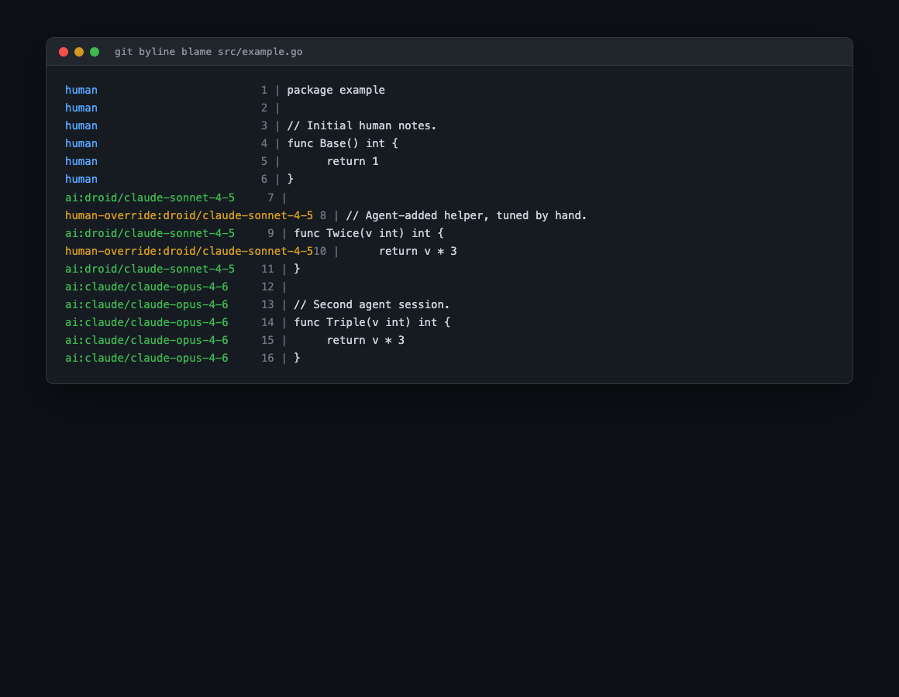
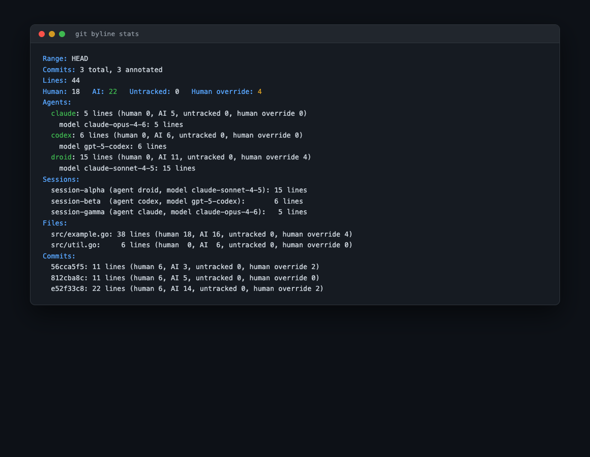
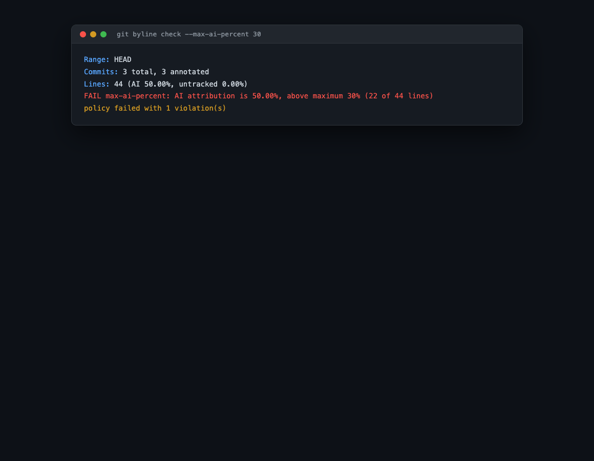
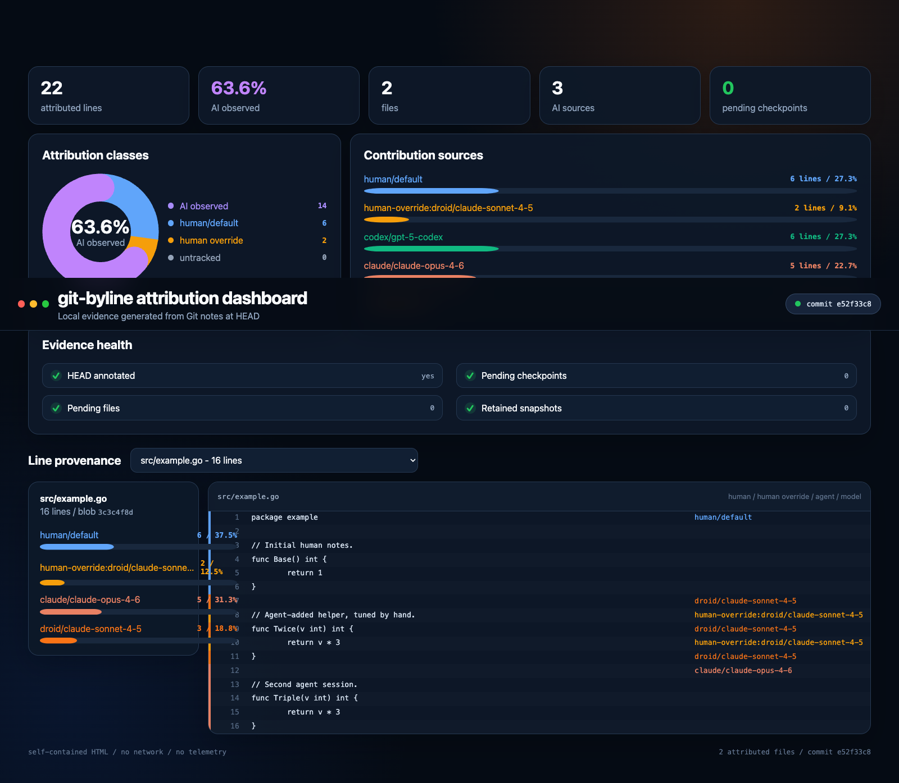
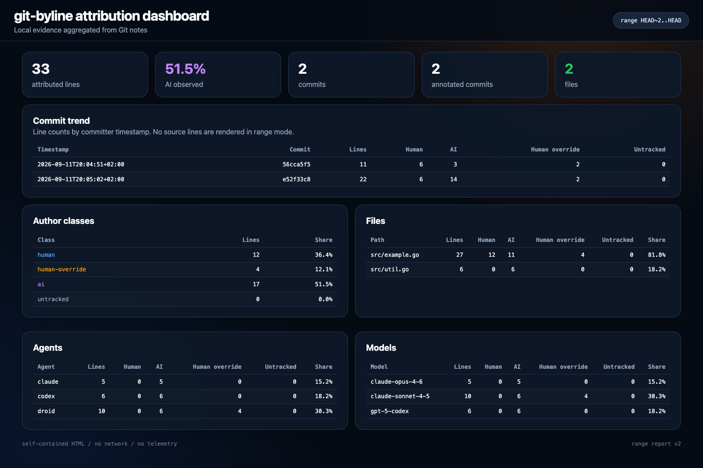
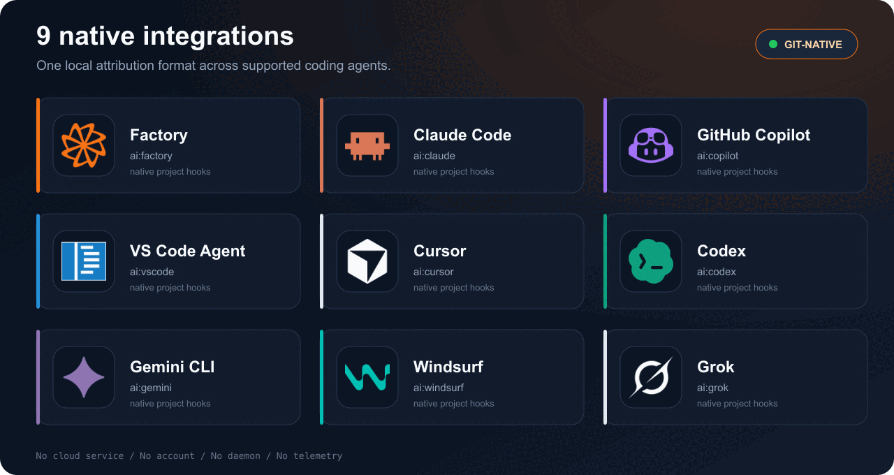
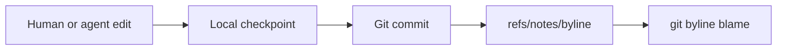

# git-byline

**Know which lines came from humans and AI - without another analytics
service.**

[](https://github.com/comarch/git-byline/actions/workflows/ci.yml)
[](https://github.com/comarch/git-byline/security.yml)
[](https://codecov.io/gh/comarch/git-byline)
[](go.mod)
[](promptscript.yaml)
[](LICENSE)
[](docs/SECURITY_MODEL.md)

Git records who committed a line. It cannot tell whether that line came from a
person, an AI agent, or older history. git-byline adds that missing layer.
Local hooks observe edits, Git notes keep deterministic provenance, and
`git byline blame` makes it readable.

> **Observed provenance, not AI detection.** git-byline records agent edits when
> they happen. It does not guess from code style, tokens, or statistical
> classifiers.



Real output from a temporary Git repository. One file, four provenance states:
human lines, two agent sessions with their models, and `human-override` lines
where a person rewrote agent output - with the replaced session's metadata
kept for audit.

## Four states per line, not one label per commit

Every text line carries exactly one state, stored as versioned JSON in Git
notes:

| State | Meaning | Carries |
| --- | --- | --- |
| `human` | No supported agent checkpoint claimed the final transition | line range |
| `ai` | A supported hook observed an agent edit | agent, model, session, timestamps |
| `human-override` | A person replaced AI output; the AI origin stays visible | agent, model, session, timestamps |
| `untracked` | Evidence missing or ambiguous - never guessed | line range |

## Why teams use it

| Need | What git-byline provides |
| --- | --- |
| Faster code review | Reviewers can locate agent-edited ranges instead of treating a mixed commit as one opaque change. |
| Local provenance evidence | Versioned line ranges, agent, model, session, and timestamp metadata live in Git objects and notes. |
| Private repository support | No code, prompt, or transcript is sent to a separate service. Note metadata follows the selected Git remote unless automatic sharing is disabled with `--local-notes`. |
| Honest unknowns | Legacy and ambiguous provenance becomes `untracked`, never a confident guess. |
| Automation | Text for people and versioned JSON for local tools and policy checks. |
| Audit-ready output | Machine-readable disclosure documents, verifiable notes, and a policy gate with a stable exit code. |

## Seventeen commands, one binary

| Capability | Commands |
| --- | --- |
| Track | `checkpoint`, `annotate`, `rewrite`, `install-hooks`, `uninstall` |
| Inspect | `blame`, `status`, `stats`, `dashboard`, `verify` |
| Enforce | `check`, `disclosure` |
| Interoperate | `export`, `import`, `ci` |
| Meta | `version`, `help` |

### Aggregate without reading blobs



`git byline stats` aggregates notes over any revision range: author classes,
agents, models, sessions, files, and commits, in deterministic order. Versioned
JSON output feeds local tooling.

### Enforce policy in CI or hooks



`git byline check --max-ai-percent 30` exits 1 on violation, 0 on success.
Flags only: no configuration file, no new format to maintain. JSON output
lists every violation.

### Local dashboard, no hosted service



`git byline dashboard` renders a self-contained HTML report: attribution
classes, contribution sources, evidence health, and per-line provenance with
source lines. No CDN, font, image, script, or API is loaded.

Range mode aggregates a whole history slice with a commit trend and bounded
breakdowns, without source lines:



```sh
git byline dashboard                              # current HEAD, source lines
git byline dashboard --range HEAD~10..HEAD        # trend and breakdowns
git byline dashboard --output report.html src/example.go
```

### Provenance that survives history rewrites

Rebase, amend, cherry-pick, reset, branch switch, and stash transitions
reproject attribution onto the new content through managed Git hooks. Managed
hooks carry the same markers, backups, and uninstall symmetry everywhere:

| Operation | Survives via |
| --- | --- |
| rebase, amend, cherry-pick | `post-rewrite` and `post-commit` hooks |
| merge, pull | `post-merge` hook, first-parent authoritative |
| reset soft/mixed/hard, branch switch | `reference-transaction` and `post-checkout` hooks |
| stash push/pop/apply | stash notes under `refs/notes/byline-stash` |

Unmatched rewritten content becomes `untracked`, never reassigned by guess.
The full matrix with per-operation status lives in
[compatibility](docs/COMPATIBILITY.md).

### Files agents write through the shell

Agents do not only use edit tools. `shell_pre` and `shell_post` checkpoints
snapshot the dirty set and attribute only paths whose blobs actually changed,
so concurrent unrelated human edits are not claimed. The remaining race is a
documented limitation, not a silent guess.

### Interoperate, do not lock in

```sh
git byline export --format gitai --output authorship.txt
git byline import --format gitai --range HEAD~5..HEAD --dry-run
git byline export --format agent-trace --output trace.json
```

Read and write the [Git AI Standard v3](https://github.com/git-ai-project/git-ai)
authorship format at `refs/notes/ai`, and write Agent Trace 0.1 records.
Import never overwrites a different existing note: it skips with a warning.
Mapping rules are documented in [interop](docs/INTEROP.md).

### Reconstruct attribution after forge merges

Squash and rebase merges on GitHub or GitLab create commits that never passed
a local hook. `git byline ci install` writes a least-privilege workflow;
`git byline ci run` reconstructs attribution from the pull request commits,
pairing by patch ID for rebase merges and folding in commit order for
squashes. The binary writes notes locally; the workflow pushes the notes ref
through Git, exactly like the pre-push hook.

### Machine-readable disclosure input

```sh
git byline disclosure --format cyclonedx --output sbom.json
```

One command, three formats: a versioned native JSON document, CycloneDX 1.6
JSON, and SPDX 3.0.1 JSON-LD using the AI profile. AI share is defined
consistently as AI lines plus `human-override` lines over total lines. This is
machine-readable input for an AI content disclosure process. It is not a
compliance certificate.

### Verify what you ship

`git byline verify` checks every noted commit: decodable notes, supported
versions, normalized paths, blob-pinned ranges, ordered coverage without gaps.
`--deep` reads blobs and proves exact line counts under the existing limits.
Together, `disclosure` and `verify` are the pair an auditor asks for: the
artifact, and the means to check it.

## What makes it different

- **Line-level, not commit-level.** One commit can contain human, AI, and
  untracked ranges.
- **Evidence, not heuristics.** Pre-edit and post-edit snapshots establish
  provenance at edit time.
- **Git-native.** Checkpoint blobs and retention refs stay local.
  `refs/notes/byline` follows ordinary pushes after Git hooks are installed.
- **Narrow trust boundary.** No account, cloud service, daemon, telemetry,
  prompt storage, or transcript storage. The binary opens no network
  connection; the managed pre-push hook invokes Git to publish notes.
- **Built for real Git behavior.** Partial commits, renames, linked worktrees,
  restarts, history rewrites, and Git garbage collection are covered.
- **Portable.** One pure Go binary, no CGo or language runtime, six release
  targets.

## How it compares

| Approach | Granularity | What it misses in a mixed commit |
| --- | --- | --- |
| Standard `git blame` | Line to commit and commit author | Whether a person or agent produced each line |
| Commit trailers (`Co-authored-by`, `Assisted-by`) | Commit-level declaration | Exact line ranges and edit-time evidence |
| AI assistant usage dashboards | User and organization aggregates | Durable, tool-neutral provenance in local Git |
| Prompt-linked provenance platforms | Line plus prompt context | Minimal data collection when prompts must stay excluded |
| **git-byline** | **Line-level observed provenance** | Deliberately no hosted dashboard or prompt history |

The closest category peer is
[Git AI](https://github.com/git-ai-project/git-ai). Both use agent
checkpoints, line-level provenance, and Git notes. Git AI adds prompt-linked
provenance and lifecycle observability; git-byline intentionally excludes
prompts, transcripts, cloud sync, hosted analytics, accounts, daemons, and
binary network calls, and instead covers history rewrites, shell-written
files, interop, forge merges, policy gates, and disclosure output. Choose the
broader model when prompt context is required. Choose git-byline when local
operation, prompt exclusion, and a small trust boundary matter more.

git-byline is not a productivity score, AI detector, or compliance
certificate. It is a small provenance primitive for teams that want stronger
review evidence with a smaller data boundary. More detail:
[why git-byline](docs/WHY_GIT_BYLINE.md).

## 9 native integrations

One attribution format across supported coding agents. PromptScript generates
native project hooks for all nine surfaces:



| Factory | Claude Code | GitHub Copilot | VS Code Agent | Cursor | Codex | Gemini CLI | Windsurf | Grok |
| :---: | :---: | :---: | :---: | :---: | :---: | :---: | :---: | :---: |
| `ai:factory` | `ai:claude` | `ai:copilot` | `ai:vscode` | `ai:cursor` | `ai:codex` | `ai:gemini` | `ai:windsurf` | `ai:grok` |

Platforms without a native project-hook API need an external watcher or
daemon. git-byline deliberately adds neither. See
[compatibility](docs/COMPATIBILITY.md).

## Requirements

| Component | Supported |
| --- | --- |
| Git | 2.31 or newer |
| Build toolchain | Go 1.24 or newer |
| Operating systems | Linux, macOS, Windows |
| Architectures | amd64, arm64 |
| Text files | Valid UTF-8 without NUL bytes |

Git 2.31 is the minimum because git-byline uses absolute Git path discovery.
CI tests Go 1.24 and current stable Go on Linux, plus Go 1.24 on macOS and
Windows. See [compatibility details](docs/COMPATIBILITY.md).

## Install

Factory users can install the marketplace plugin and let
`/git-byline-setup` select and verify the local runtime:

```text
droid plugin marketplace add comarch/git-byline
droid plugin install git-byline@git-byline --scope user
```

Linux and macOS:

```sh
curl -fsSL --proto '=https' --proto-redir '=https' --tlsv1.2 \
  https://raw.githubusercontent.com/comarch/git-byline/main/install.sh | bash
```

Windows PowerShell:

```powershell
irm https://raw.githubusercontent.com/comarch/git-byline/main/install.ps1 | iex
```

Both installers verify the release archive checksum and binary version before
installation. The one-liners execute a mutable installer from protected
`main`; checksum-first, reviewed-script, Go toolchain, and manual archive
methods are documented in [installation](docs/INSTALL.md).

Build from source:

```sh
git clone https://github.com/comarch/git-byline.git
cd git-byline
CGO_ENABLED=0 go build -trimpath -o git-byline ./cmd/git-byline
```

## Start in three steps

### 1. Activate hooks

Install Droid and the Git hook for the current repository:

```sh
git byline install-hooks --agent droid --git --user
git byline status
```

Use `--agent claude` for Claude Code or `--agent all` for both. `--user`
stores the agent hook under your home directory with the current executable
path. Use `--project` to create a portable, reviewable project configuration
that resolves `git-byline` through `PATH`.
User-scoped agent hooks quietly ignore events outside a Git worktree.

`--git` installs `post-commit` attribution and `pre-push` note sharing.
Ordinary pushes then publish line ranges, paths, agent and model names,
session identifiers, and timestamps to the same remote. Use `--local-notes`
to install attribution without automatic note sharing.

### 2. Work normally

Use your agent, edit by hand, stage selected changes, and commit:

```sh
git add src/example.go
git commit -m "feat: add example"
```

### 3. Inspect committed provenance

```sh
git byline blame src/example.go
```

Example output:

```text
human                        1 | package example
ai:droid/model-name          2 | func AddedByAgent() {}
human-override:droid/model-name 3 | // Agent line a person rewrote.
untracked                    4 | // Predates attribution history.
```

Get machine-readable output:

```sh
git byline blame --json src/example.go
git byline status --json
```

Remove only hooks managed by git-byline:

```sh
git byline uninstall --agent droid --git --user
```

Use `--agent none --git` to manage only the Git hook.

Backups of changed agent and Git hook configuration use the
`.git-byline.bak` suffix. Existing shell hooks and unrelated agent
configuration are preserved. Non-shell hooks, symlinked paths, external
`core.hooksPath` locations, and other non-regular files are refused.

## Commands

| Command | Purpose |
| --- | --- |
| `checkpoint <preset>` | Record a human or AI edit snapshot from hook input |
| `annotate` | Replay pending snapshots and annotate `HEAD` |
| `blame [--json] <file>` | Show line attribution for a file at `HEAD` |
| `status [--json]` | Show checkpoint, pending, and annotation state |
| `dashboard [--range <rev-range>] [--repo] [--output FILE] [file]` | Generate a self-contained local HTML report |
| `stats [<rev-range>] [--json]` | Aggregate attribution statistics without reading blobs |
| `verify [<rev-range>] [--deep] [--json]` | Verify attribution notes and blob-pinned ranges |
| `check [<rev-range>] [--max-ai-percent N] [--max-untracked-percent N] [--require-note] [--json]` | Check attribution policy limits |
| `disclosure [--range <rev-range>] [--format json\|spdx\|cyclonedx] [--output FILE]` | Write machine-readable AI content disclosure input |
| `rewrite --mode MODE --hook-input stdin` | Preserve attribution across rewrites, resets, switches, and stash transitions |
| `export --format gitai\|agent-trace [--commit <rev>] [--output FILE]` | Export attribution to an interop format |
| `import --format gitai [--range <rev-range>] [--dry-run]` | Import Git AI attribution notes |
| `ci install\|run --provider github\|gitlab` | Install or run forge merge attribution workflows |
| `install-hooks` | Merge agent hooks plus Git annotation and note-sharing hooks |
| `uninstall` | Remove only git-byline-managed hooks |
| `version` | Print the build version |
| `help [command]` | Show command help |

`git byline check` exits with status 1 when a policy violation is found.

`git byline disclosure` writes a private, deterministic report from
attribution notes. It includes range and file AI share, agents, models,
sessions, commits, generation time, and tool version. Formats are the native
versioned JSON document, CycloneDX 1.6 JSON, and SPDX 3.0.1 JSON-LD using the
AI profile. Existing output files are never replaced and paths containing
control characters are rejected.

AI share is defined consistently as AI lines plus `human-override` lines,
divided by total lines. `human-override` preserves metadata for AI output a
person replaced. Disclosure output is machine-readable input for an AI content
disclosure process. It is not a compliance certificate.

Rewrite hook modes are `post-rewrite`, `post-checkout`, `post-merge`,
`ref-txn`, and `stash-apply`. Git hooks call the first four modes. Run
`stash-apply` manually when applying a stash without a Git hook:

```sh
printf '%s 1\n' "$(git rev-parse stash@{0})" |
  git byline rewrite --mode stash-apply --hook-input stdin
```

The second field keeps the stash attribution note. Use `0` after a manual
stash pop to remove it. Hook input accepts only full repository object IDs.

PromptScript 1.18.1 compiles native project hooks for Factory, Claude Code,
GitHub Copilot, VS Code Agent, Cursor, Codex, Gemini CLI, Windsurf, and Grok.
The generic agent-v1 adapter accepts its standard JSON payload through stdin:

```sh
git byline checkpoint agent-v1 --hook-input stdin
```

The payload selects the event type itself. Required fields for `human` and
`ai_agent` edit events are `type`, `agent_name`, and `edited_filepaths`;
`agent_name` identifies the watcher or agent surface, not the author kind.
Shell events use `shell_pre` or `shell_post` and omit `edited_filepaths`.
`model` and `conversation_id` are optional:

```json
{"type":"ai_agent","agent_name":"watcher","model":"model-name","conversation_id":"session-1","edited_filepaths":["src/example.go"]}
```

## How attribution works

Agent hooks capture file states before and after an edit. Git stores those
snapshots as content-addressed blobs. A local retention ref protects pending
blobs from garbage collection. After a commit, `annotate` replays snapshots,
projects provenance onto committed content, validates complete non-overlapping
line coverage, and writes canonical JSON to `refs/notes/byline`.

Lines without checkpoint history are `untracked`. Content changed after the
last agent checkpoint defaults to `human`. More detail:
[architecture and data formats](docs/ARCHITECTURE.md).



## Local data and privacy

git-byline stores:

- `.git/byline/checkpoints.jsonl`
- `.git/byline/state.json`
- pending snapshot blobs in the Git object database
- `refs/worktree/byline/checkpoints`
- `refs/notes/byline`
- `refs/notes/byline-stash`
- `refs/notes/byline-stash-owner`

Linked worktrees keep checkpoint state separate. Notes are shared within the
common repository. After `install-hooks --git`, the managed `pre-push` hook
publishes `refs/notes/byline` to the same remote before the branch push.
Notes disclose repository paths, agent and model names, session identifiers,
timestamps, blob IDs, and line ranges.

Fetch notes explicitly in another clone:

```sh
git fetch origin refs/notes/byline:refs/notes/byline
```

Disable automatic note sharing by reinstalling Git hooks with:

```sh
git byline install-hooks --agent none --git --local-notes
```

git-byline does not store raw hook payloads, prompts, transcripts, environment
variables, or file contents in checkpoint JSON. Snapshot blobs contain file
content and remain local unless a user explicitly transfers related refs or
Git objects.

Generated dashboards contain committed source lines and attribution metadata.
Default output uses a private temporary file. Keep reports local unless their
content was reviewed for sharing.

## Limitations

- Files above 64 MiB or 1,000,000 lines are skipped.
- Binary, invalid UTF-8, symlink, submodule, device, and ignored paths are
  skipped.
- Rebase, amend, cherry-pick, reset, branch switch, and stash hooks reproject
  attribution when Git supplies the required transition data. Use
  `git byline rewrite` manually after a path-limited reset or stash apply.
- Stash apply is manual when `git stash apply` is used. Pass the stash object
  ID and `1` to keep its pending attribution note.
- Merge commits use first-parent history. Unmatched merge result content is
  `untracked`.
- Duplicate equal lines in partial commits are resolved deterministically, but
  Git provides no staging timestamp to prove which duplicate was selected.
- If several commits complete without annotation, git-byline refuses to guess
  across the gap.
- Attribution notes are limited to 500 files and 16 MiB.
- Whole-commit dashboards additionally limit rendered source to 100,000 lines
  and 16 MiB.
- Notes are pushed before the branch. A later branch rejection can leave note
  metadata on the remote before its target commit arrives.
- Prompts and transcripts are not stored.

## Troubleshooting

`git byline status` reports pending checkpoints, retained snapshots, and
whether `HEAD` is annotated.

If a user or Git hook cannot find the executable, reinstall hooks using the
final binary location. Project agent hooks resolve `git-byline` through the
agent process `PATH`.

If annotation reports a commit gap, do not delete `.git/byline` or rewrite
notes. Preserve the repository and open a redacted bug report with commit IDs
shortened or replaced.

If blame shows `untracked`, check that agent and Git hooks are installed, then
make a new checkpointed edit and commit. Existing history remains honestly
untracked.

## Documentation

Start with the [documentation map](docs/README.md).

| Topic | Guide |
| --- | --- |
| Product fit and alternatives | [Why git-byline](docs/WHY_GIT_BYLINE.md) |
| Installation paths | [Installation](docs/INSTALL.md) |
| Supported systems and agents | [Compatibility](docs/COMPATIBILITY.md) |
| Runtime and data formats | [Architecture](docs/ARCHITECTURE.md) |
| Interop formats and mapping | [Interop](docs/INTEROP.md) |
| Threats and privacy boundary | [Security model](docs/SECURITY_MODEL.md) |
| Local quality gate | [Validation](docs/VALIDATION.md) |

## Development

Run the complete local validation contract:

```sh
go run ./tools/validate
```

It checks formatting, vet, tests, at least 80 percent statement coverage,
CGO-free builds for all six targets, dependency and import policy,
installer and marketplace contracts, PromptScript drift, workflow template
contracts, secrets, placeholders, private paths, and forbidden characters.

See [CONTRIBUTING.md](CONTRIBUTING.md), [validation](docs/VALIDATION.md), and
[release procedure](docs/RELEASES.md).

## Support and security

Use the bug form for reproducible defects and GitHub Discussions for usage
questions. Never include private repository content, raw hook input, prompts,
transcripts, credentials, or full environment dumps.

Report vulnerabilities privately through
[GitHub Security Advisories](https://github.com/comarch/git-byline/security/advisories/new).
See [SECURITY.md](SECURITY.md).

## License

Author: Wojciech Guziak (Comarch S.A.).

MIT License. Copyright (c) 2026 Comarch S.A. See [LICENSE](LICENSE).
