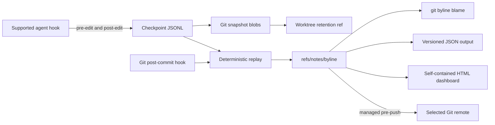

# Architecture and data formats

git-byline is a single local Go binary. Agent hooks record snapshots. A Git
hook converts those snapshots into line attribution attached to commits.

## System at a glance



Checkpoint and replay state is isolated per linked worktree. Attribution notes
are shared by commit inside the common repository. Normal Git never transfers
worktree state. Push and fetch do not transfer notes unless a managed hook or
explicit refspec publishes them.

## Boundaries

| Package | Responsibility |
| --- | --- |
| `internal/app` | CLI parsing, streams, exit codes, orchestration |
| `internal/preset` | Untrusted Droid, Claude Code, and agent-v1 input |
| `internal/gitcmd` | All Git subprocess calls and safe worktree reads |
| `internal/model` | Versioned persisted records and invariants |
| `internal/store` | Checkpoint JSONL and atomic state files |
| `internal/lock` | Cross-process repository operation locks |
| `internal/engine` | Pure line splitting, replay, projection, ranges |
| `internal/notes` | Canonical note encoding and history lookup |
| `internal/provenance` | Checkpoint, annotate, blame, and status workflows |
| `internal/dashboard` | Deterministic self-contained HTML reports |
| `internal/hooks` | Idempotent agent and Git hook mutation |

Production code runs Git only through `internal/gitcmd`. The attribution engine
does not access Git, files, JSON, clocks, subprocesses, or global state.

The dashboard renderer consumes validated blame and status results. It embeds
all styles, script, source lines, and metrics into one HTML file. The report
uses a restrictive Content Security Policy and contains no external URLs or
runtime network requests. It reads only paths from the attribution note
attached directly to `HEAD`, with limits of 16 MiB for the note, 500 files,
100,000 lines, and 16 MiB of committed source content.

## Runtime flow

1. A PreToolUse hook snapshots each selected path as `human`.
2. The agent edits files.
3. A PostToolUse hook snapshots resulting paths as `ai`.
4. Snapshot bytes are written to the Git object database.
5. A worktree-local retention ref protects pending blobs from Git garbage
   collection.
6. After commit, `annotate` replays snapshots against the first parent.
7. Committed lines receive complete, ordered, non-overlapping ranges.
8. Canonical note JSON is written to `refs/notes/byline`.
9. State advances atomically, then the retention ref is compacted.
10. Unless installed with `--local-notes`, a managed `pre-push` hook
    publishes the notes ref before an ordinary branch push.

If annotation starts after new edits already happened on the new `HEAD`,
checkpoints based on that `HEAD` are carried into pending state for the next
commit. A checkpoint from an unrelated base commit fails closed.

## Checkpoint log

Path: worktree-specific Git directory plus `byline/checkpoints.jsonl`.

One JSON object per line:

```json
{"version":1,"kind":"edit","seq":2,"base_commit":"abc123","ts":"2026-01-02T03:04:05Z","type":"ai","session":"session-1","agent":"droid","model":"model-name","files":[{"path":"src/example.go","exists":true,"blob":"def456"}]}
```

Properties:

- append-only except for truncated-tail recovery;
- streamed with a 64 MiB total limit and 100,000-record limit;
- sequence order is authoritative;
- one truncated final line is ignored with a warning;
- the next append removes that truncated tail before writing a record;
- malformed interior lines fail;
- unknown record versions are skipped with a warning;
- raw hook input and file content are not embedded.

`exists=false` records deletion without a blob.

## State

Path: worktree-specific Git directory plus `byline/state.json`.

```json
{"version":1,"last_annotated_commit":"def456","last_checkpoint_seq":42,"notes_version":2,"pending":{"base_commit":"def456","files":{}}}
```

State uses a temporary file, file sync, and atomic rename. It advances only
after the note write succeeds. State reads are limited to 64 MiB.

Pending files preserve attribution excluded by a partial commit. Their blobs
remain reachable through `refs/worktree/byline/checkpoints`.

## Notes

Ref: `refs/notes/byline`.

```json
{
  "version": 2,
  "files": {
    "src/example.go": {
      "blob": "abc123",
      "ranges": [
        {"start": 1, "end": 3, "author": "human"},
        {
          "start": 4,
          "end": 7,
          "author": "ai",
          "agent": "droid",
          "model": "model-name",
          "session": "session-1",
          "ts": "2026-01-02T03:04:05Z"
        },
        {
          "start": 8,
          "end": 9,
          "author": "human-override",
          "agent": "droid",
          "model": "model-name",
          "session": "session-1",
          "ts": "2026-01-02T03:04:05Z"
        },
        {"start": 10, "end": 11, "author": "untracked"}
      ]
    }
  },
  "sessions": {
    "session-1": {
      "agent": "droid",
      "model": "model-name",
      "first_ts": "2026-01-02T03:04:05Z",
      "last_ts": "2026-01-02T03:04:05Z",
      "added": 4,
      "deleted": 1,
      "accepted": 3,
      "overridden": 1
    }
  }
}
```

Ranges are inclusive and one-based. Every line has exactly one range. Map keys
and fields serialize deterministically with a trailing newline. Encoders and
decoders reject notes above 500 files or 16 MiB. Readers accept note versions 1
and 2. Writers emit version 2. Version 2 adds the per-session metrics map;
version 1 notes have no session map.
Sessions whose output does not survive the commit remain listed with zero
counters.

Readers accept only supported note versions. Unknown versions, missing notes,
and blob mismatches produce warnings and `untracked` output instead of guessed
attribution.

## Attribution

Line splitting retains `LF`, `CRLF`, and absent final terminators. Exact equal
lines keep existing attribution. Between two exact matched anchors,
the second matching layer pairs only still-unmatched lines whose keys are equal
after leading and trailing whitespace is removed. It preserves order and makes
formatter-only indentation changes carry attribution. It does not tokenize,
use similarity, or compare semantics. Matching stops outside matched anchors
and after whitespace-only equality. Anything beyond that stays untracked or
uses the documented transition fallback only for lines introduced by a
transition; the matcher never guesses.

Inserted or replaced lines receive the transition author. When an AI snapshot
is followed by a human snapshot, an unmatched human line in a gap containing
lines from the most recent AI transition becomes `human-override` and carries
that AI transition's agent, model, session, and timestamp. Content entering the
committed blob after the final checkpoint defaults to `human`.
The engine uses deterministic longest-common-subsequence alignment for normal
files. A bounded greedy alignment prevents quadratic memory use on large line
sets. Duplicate lines use stable positional tie-breaking.

Files larger than 64 MiB or 1,000,000 lines, binary data, invalid UTF-8,
symlinks, submodules, devices, ignored paths, and paths escaping the active
worktree are rejected or skipped.

## Worktrees and locking

Each linked worktree has separate checkpoints, state, pending blobs, retention
ref, and operation lock. Notes remain common because they are keyed by commit.

Annotation acquires the common notes lock before the worktree operation lock.
Locks use operating-system advisory file locking and release automatically
when a process exits.

## Sharing notes

`install-hooks --git` installs a managed `pre-push` hook. Before an ordinary
branch push, it sends `refs/notes/byline` to the same remote. The internal
notes push uses `--no-verify` to avoid recursively running the hook. Unrelated
`pre-push` checks still run once for the outer branch push. A notes failure
stops the branch push, but a successful notes push cannot guarantee that the
later branch update will be accepted.

Use `--local-notes` to install `post-commit` annotation without the sharing
hook. Fetch shared notes into another clone explicitly:

```sh
git fetch origin refs/notes/byline:refs/notes/byline
```

Concurrent clones can create divergent notes histories. The managed hook
refuses a non-fast-forward notes update and stops the branch push. Merge the
remote notes explicitly, review conflicts, then retry:

```sh
git fetch origin refs/notes/byline:refs/notes/byline-remote
git notes --ref=refs/notes/byline merge refs/notes/byline-remote
git update-ref -d refs/notes/byline-remote
git push
```

Checkpoint logs, state files, retention refs, and generated HTML dashboards
remain local. They are not included when attribution notes are pushed.
