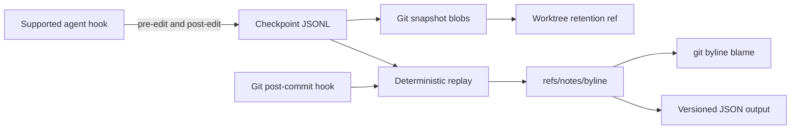

# Architecture and data formats

git-byline is a single local Go binary. Agent hooks record snapshots. A Git
hook converts those snapshots into line attribution attached to commits.

## System at a glance



Checkpoint and replay state is isolated per linked worktree. Attribution notes
are shared by commit inside the common repository. Normal Git push and fetch
do not transfer either worktree state or notes.

## Boundaries

| Package | Responsibility |
| --- | --- |
| `internal/app` | CLI parsing, streams, exit codes, orchestration |
| `internal/preset` | Untrusted Droid, Claude Code, and agent-v1 input |
| `internal/gitcmd` | All Git subprocess calls and safe worktree reads |
| `internal/model` | Versioned persisted records and invariants |
| `internal/store` | Checkpoint JSONL and atomic state files |
| `internal/lock` | Cross-process repository operation locks |
| `internal/engine` | Pure line splitting, replay, projection, ranges |
| `internal/notes` | Canonical note encoding and history lookup |
| `internal/provenance` | Checkpoint, annotate, blame, and status workflows |
| `internal/hooks` | Idempotent agent and Git hook mutation |

Production code runs Git only through `internal/gitcmd`. The attribution engine
does not access Git, files, JSON, clocks, subprocesses, or global state.

## Runtime flow

1. A PreToolUse hook snapshots each selected path as `human`.
2. The agent edits files.
3. A PostToolUse hook snapshots resulting paths as `ai`.
4. Snapshot bytes are written to the Git object database.
5. A worktree-local retention ref protects pending blobs from Git garbage
   collection.
6. After commit, `annotate` replays snapshots against the first parent.
7. Committed lines receive complete, ordered, non-overlapping ranges.
8. Canonical note JSON is written to `refs/notes/byline`.
9. State advances atomically, then the retention ref is compacted.

If annotation starts after new edits already happened on the new `HEAD`,
checkpoints based on that `HEAD` are carried into pending state for the next
commit. A checkpoint from an unrelated base commit fails closed.

## Checkpoint log

Path: worktree-specific Git directory plus `byline/checkpoints.jsonl`.

One JSON object per line:

```json
{"version":1,"kind":"edit","seq":2,"base_commit":"abc123","ts":"2026-01-02T03:04:05Z","type":"ai","session":"session-1","agent":"droid","model":"model-name","files":[{"path":"src/example.go","exists":true,"blob":"def456"}]}
```

Properties:

- append-only except for truncated-tail recovery;
- sequence order is authoritative;
- one truncated final line is ignored with a warning;
- the next append removes that truncated tail before writing a record;
- malformed interior lines fail;
- unknown record versions are skipped with a warning;
- raw hook input and file content are not embedded.

`exists=false` records deletion without a blob.

## State

Path: worktree-specific Git directory plus `byline/state.json`.

```json
{"version":1,"last_annotated_commit":"def456","last_checkpoint_seq":42,"notes_version":1,"pending":{"base_commit":"def456","files":{}}}
```

State uses a temporary file, file sync, and atomic rename. It advances only
after the note write succeeds.

Pending files preserve attribution excluded by a partial commit. Their blobs
remain reachable through `refs/worktree/byline/checkpoints`.

## Notes

Ref: `refs/notes/byline`.

```json
{
  "version": 1,
  "files": {
    "src/example.go": {
      "blob": "abc123",
      "ranges": [
        {"start": 1, "end": 3, "author": "human"},
        {
          "start": 4,
          "end": 7,
          "author": "ai",
          "agent": "droid",
          "model": "model-name",
          "session": "session-1",
          "ts": "2026-01-02T03:04:05Z"
        },
        {"start": 8, "end": 11, "author": "untracked"}
      ]
    }
  }
}
```

Ranges are inclusive and one-based. Every line has exactly one range. Map keys
and fields serialize deterministically with a trailing newline.

Readers accept only supported note versions. Unknown versions, missing notes,
and blob mismatches produce warnings and `untracked` output instead of guessed
attribution.

## Attribution

Line splitting retains `LF`, `CRLF`, and absent final terminators. Equal lines
keep existing attribution. Inserted or replaced lines receive the transition
author. Content entering the committed blob after the final checkpoint
defaults to `human`.

The engine uses deterministic longest-common-subsequence alignment for normal
files. A bounded greedy alignment prevents quadratic memory use on large line
sets. Duplicate lines use stable positional tie-breaking.

Files larger than 64 MiB or 1,000,000 lines, binary data, invalid UTF-8,
symlinks, submodules, devices, ignored paths, and paths escaping the active
worktree are rejected or skipped.

## Worktrees and locking

Each linked worktree has separate checkpoints, state, pending blobs, retention
ref, and operation lock. Notes remain common because they are keyed by commit.

Annotation acquires the common notes lock before the worktree operation lock.
Locks use operating-system advisory file locking and release automatically
when a process exits.

## Sharing notes

Normal clone, fetch, and push operations do not transfer
`refs/notes/byline`. Sharing notes is an explicit Git action. Review note
content before transfer because it can disclose paths, timestamps, agent and
model names, and session identifiers.
