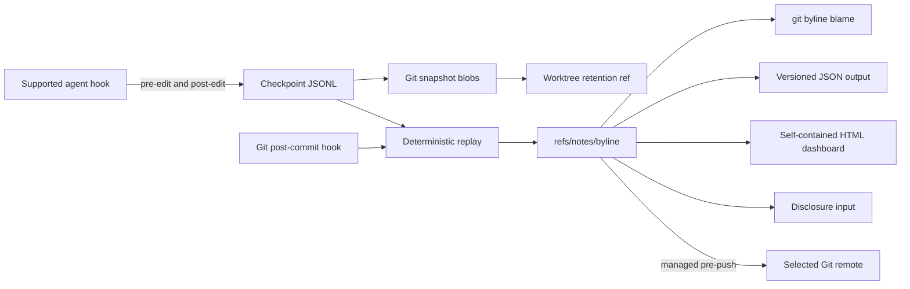

# Architecture and data formats

git-byline is a single local Go binary. Agent hooks record snapshots. A Git
hook converts those snapshots into line attribution attached to commits.

## System at a glance



Checkpoint and replay state is isolated per linked worktree. Attribution notes
are shared by commit inside the common repository. Normal Git never transfers
worktree state. Push and fetch do not transfer notes unless a managed hook or
explicit refspec publishes them.

## Boundaries

| Package | Responsibility |
| --- | --- |
| `internal/app` | CLI parsing, streams, exit codes, orchestration |
| `internal/preset` | Untrusted Droid, Claude Code, and agent-v1 input |
| `internal/gitcmd` | All Git subprocess calls and safe worktree reads |
| `internal/runner` | The update command's curl fetches, latest-release probe, and self-exec of the staged or installed binary |
| `internal/model` | Versioned persisted records and invariants |
| `internal/store` | Checkpoint JSONL and atomic state files |
| `internal/lock` | Cross-process repository operation locks |
| `internal/engine` | Pure line splitting, replay, projection, ranges |
| `internal/notes` | Canonical note encoding and history lookup |
| `internal/provenance` | Checkpoint, annotate, blame, and status workflows |
| `internal/transcript` | Bounded session transcript and settings reads for model names |
| `internal/dashboard` | Deterministic self-contained HTML reports |
| `internal/disclosure` | Deterministic native, CycloneDX, and SPDX disclosure input |
| `internal/hooks` | Idempotent agent and Git hook mutation |

Production code runs Git only through `internal/gitcmd`. The attribution engine
does not access Git, files, JSON, clocks, subprocesses, or global state. The
update command's curl fetches and its self-exec of the staged or installed
binary run only through `internal/runner`; no production package imports a
network stack.

The dashboard renderer consumes validated blame and status results. It embeds
all styles, script, source lines, and metrics into one HTML file. The report
uses a restrictive Content Security Policy and contains no external URLs or
runtime network requests. It reads only paths from the attribution note
attached directly to `HEAD`, with limits of 16 MiB for the note, 500 files,
100,000 lines, and 16 MiB of committed source content.

## Runtime flow

1. A PreToolUse hook snapshots each selected path as `human`.
2. The agent edits files.
3. A PostToolUse hook snapshots resulting paths as `ai`.
4. Snapshot bytes are written to the Git object database.
5. Droid and Claude Code payloads name no model, so an AI checkpoint with the
   fallback model resolves the newest model from the session transcript or
   the session settings file named by `transcript_path`. Only the model
   identifier is read; transcript content never enters any record.
6. A worktree-local retention ref protects pending blobs from Git garbage
   collection.
7. After commit, `annotate` replays snapshots against the first parent.
8. Committed lines receive complete, ordered, non-overlapping ranges.
9. Canonical note JSON is written to `refs/notes/byline`.
10. State advances atomically, then the retention ref is compacted.
11. Unless installed with `--local-notes`, a managed `pre-push` hook
    merges the remote notes into the notes ref and publishes it before an
    ordinary branch push.

Agent hooks often run in the main checkout, for example after
`cd "$FACTORY_PROJECT_DIR"`, while the agent edits a linked worktree. So
`checkpoint` records each edit path in the worktree of the same repository
that owns it. The owner is the innermost worktree root from
`git worktree list` that contains the resolved path, so a linked worktree
nested in the main checkout wins over the main checkout. Each candidate is
reopened and must report the same root and the same common Git directory.
The path moves in the form the owner's own hook would send: an absolute path
as it is, a relative path relative to the owner root. So symlinks get the
same checks in both worktrees, and a relative path that reaches another
worktree only through a symlink stays in the hook's worktree and is rejected.
The owning worktree applies the usual path checks and keeps the checkpoint in
its own log and retention ref. Paths outside every worktree of the repository
stay rejected. Shell events still use the dirty paths of the worktree where
the hook runs.

If annotation starts after new edits already happened on the new `HEAD`,
checkpoints based on that `HEAD` are carried into pending state for the next
commit. A checkpoint from another branch or base parks with a warning instead
of blocking annotation; its lane resumes only when both branch ref and base
match again. Post-rewrite handling remaps checkpoint and lane bases for the
rewritten branch. A merge or pull fast-forward brings commits made elsewhere,
so annotation skips them instead of guessing, and the boundary moves only to a
tip that already carries a valid note. Pending ranges and checkpoints on the
old tip move to the new tip, except on paths the fast-forward changed: there
pending ranges are dropped and checkpoints are consumed with a warning.
`recover` previews each parked
checkpoint, its recorded branch context, object availability, and branches
that still reach its base without changing state. `recover --drop` first
validates ordinary annotation, then rechecks reachability, drops only parked
checkpoints whose base no local or remote-tracking branch can reach, and
retries annotation. Every unrelated checkpoint must be stranded; one blocked
checkpoint refuses the whole cleanup without dropping records or retrying
annotation. Hook-driven annotation never selects this destructive mode.
`annotate --drop-stranded` performs the same destructive removal without a
preview, so users should run `recover` first.

## Checkpoint log

Path: worktree-specific Git directory plus `byline/checkpoints.jsonl`.

One JSON object per line:

```json
{"version":2,"kind":"edit","seq":2,"base_commit":"abc123","branch_ref":"refs/heads/feature","lane_id":"seq:2","ts":"2026-01-02T03:04:05Z","type":"ai","session":"session-1","agent":"droid","model":"model-name","files":[{"path":"src/example.go","exists":true,"blob":"def456"}]}
```

Properties:

- new records are appended; existing records change only through
  truncated-tail recovery, base and lane rewrites, and explicit
  `recover --drop` or `annotate --drop-stranded` removal;
- streamed with a 64 MiB total limit and 100,000-record limit;
- sequence order is authoritative;
- one truncated final line is ignored with a warning;
- the next append removes that truncated tail before writing a record;
- malformed interior lines fail;
- readers accept versions 1 and 2; writers emit version 2;
- version 1 records have no branch context and use compatible base-only
  matching; rewrite upgrades them to version 2 with a stable `legacy:<base>`
  lane ID before changing their base;
- unknown record versions are skipped with a warning;
- raw hook input and file content are not embedded.

`exists=false` records deletion without a blob.

## State

Path: worktree-specific Git directory plus `byline/state.json`.

```json
{"version":3,"last_annotated_commit":"def456","last_checkpoint_seq":42,"notes_version":3,"pending":{"base_commit":"def456","files":{}},"lanes":{"refs/heads/feature":{"seq:2":41}}}
```

State uses a temporary file, file sync, and atomic rename. It advances only
after the note write succeeds. State reads are limited to 64 MiB.

Pending files preserve attribution excluded by a partial commit. Their blobs
remain reachable through `refs/worktree/byline/checkpoints`.

### Checkpoint lanes

Version 3 nests stable lane IDs below their attached local branch ref in
`lanes`. Each lane stores the highest sequence annotation consumed in that
branch context. Base commits remain on checkpoint records and may change when
history is rewritten; lane IDs change only when a fast-forward splits a lane.
This prevents squash or split rewrites from merging independent consumption
watermarks. Annotation selects records whose branch matches the current branch
and whose base matches `HEAD` or its first parent. Records based on the parent
replay into the commit, records based on `HEAD` carry as pending worktree
provenance, and every other unconsumed
record parks with a warning. This keeps sibling branches created from one base
independent. Parked lanes stay protected by the retention ref, are never
deleted automatically, and resume only when branch and base match again.
`annotate --drop-stranded` and `recover --drop` are the only paths that remove
records, and both refuse while any branch still reaches a parked base.

A fast-forward that changes a path with checkpoints on the old tip splits
their lanes. Checkpoints on unchanged paths keep their lane and move to the
new tip. Checkpoints on changed paths stay on the old tip and move to a lane
named after the last of them, which is consumed up to that sequence at once.
Lane IDs name the checkpoint that opened the lane, so the new name matches an
existing lane only when that last checkpoint opened it. Every unchanged-path
checkpoint in that lane then comes after it and stays above the watermark.
Version 1 checkpoints and `legacy:<base>` lanes cannot be split. When the
fast-forward changes one of their paths, every checkpoint on the old tip stays
parked there.

`last_checkpoint_seq` is the version 1 scalar watermark, kept as a frozen
consumption floor. Version 1 could only consume an unbroken journal prefix,
so every sequence at or below the floor is already consumed and the floor
never advances; new consumption is recorded per lane only. Version 1 state
files migrate with empty lanes. Version 2 base-only lanes migrate to stable
`legacy:<base>` IDs under the empty branch context. Migration is deterministic
in memory and persists as version 3 on the next state write. Before writing a
version 2 checkpoint, capture persists version 3 state so older binaries fail
closed instead of skipping new evidence.

## Notes

Ref: `refs/notes/byline`.

```json
{
  "version": 3,
  "files": {
    "src/example.go": {
      "blob": "abc123",
      "ranges": [
        {"start": 1, "end": 3, "author": "human", "identity": "john.doe"},
        {
          "start": 4,
          "end": 7,
          "author": "ai",
          "agent": "droid",
          "model": "model-name",
          "session": "session-1",
          "ts": "2026-01-02T03:04:05Z"
        },
        {
          "start": 8,
          "end": 9,
          "author": "human-override",
          "identity": "john.doe",
          "agent": "droid",
          "model": "model-name",
          "session": "session-1",
          "ts": "2026-01-02T03:04:05Z"
        },
        {"start": 10, "end": 11, "author": "untracked"}
      ]
    }
  },
  "sessions": {
    "droid::session-1": {
      "agent": "droid",
      "model": "model-name",
      "first_ts": "2026-01-02T03:04:05Z",
      "last_ts": "2026-01-02T03:04:05Z",
      "added": 4,
      "deleted": 1,
      "accepted": 3,
      "overridden": 1
    }
  }
}
```

Ranges are inclusive and one-based. Every line has exactly one range. Map keys
and fields serialize deterministically with a trailing newline. Encoders and
decoders reject notes above 500 files or 16 MiB. Readers accept note versions
1, 2, and 3. Writers emit version 3. Version 2 added the per-session metrics
map; version 1 notes have no session map. Version 3 adds the optional
`identity` field on `human` and `human-override` ranges, and a note below
version 3 that carries an identity is rejected.
Session keys use the deterministic `<agent>::<session>` shape, so identical
session identifiers under different agents remain separate. Sessions whose
output does not survive the commit remain listed with zero counters unless
their lines were overridden by later attribution.

State readers upgrade the legacy `notes_version: 1` and `notes_version: 2`
markers in state files to the current note version before validation. The next
successful annotation writes a version 3 note and state.

Readers accept only supported note versions. Unknown versions, missing notes,
and blob mismatches produce warnings and `untracked` output instead of guessed
attribution.

## Attribution

Line splitting retains `LF`, `CRLF`, and absent final terminators. Exact equal
lines keep existing attribution. Between two exact matched anchors,
the second matching layer pairs only still-unmatched lines whose keys are equal
after leading and trailing whitespace is removed. It preserves order and makes
formatter-only indentation changes carry attribution. It does not tokenize,
use similarity, or compare semantics. Matching stops outside matched anchors
and after whitespace-only equality. Anything beyond that stays untracked or
uses the documented transition fallback only for lines introduced by a
transition; the matcher never guesses.

Inserted or replaced lines receive the transition author. When an AI snapshot
is followed by a human snapshot, an unmatched human line in a gap containing
lines from the most recent AI transition becomes `human-override` and carries
that AI transition's agent, model, session, and timestamp. Content entering the
committed blob after the final checkpoint defaults to `human`.

## Human identity

Every `human` and `human-override` range a commit introduces carries an
`identity` token. Annotation resolves it once per commit from that commit's
author, so `git log -1 --format='%an %ae'` reproduces the source. The token is
the lowercased local part of the author email, or a reduced author name when
there is no email, restricted to `[a-z0-9._+-]` with at most 64 bytes. Input
that cannot be reduced to a valid token yields no identity, which reads as a
plain `human` line rather than a guess.

Ranges reprojected from an older note keep the identity that note stored, so
a commit never claims lines it did not introduce. Ranges from notes written
before version 3 have no identity and aggregate under `(unidentified)`.

`ai` and `untracked` ranges must not carry an identity. A merge commit
attributes unmatched content as `untracked`, including in the pending
worktree projection, so merge results are never promoted to human lines by a
later commit.
The engine uses deterministic longest-common-subsequence alignment for normal
files. A bounded greedy alignment prevents quadratic memory use on large line
sets. Duplicate lines use stable positional tie-breaking.

Files larger than 64 MiB or 1,000,000 lines, binary data, invalid UTF-8,
symlinks, submodules, devices, ignored paths, and paths escaping the
worktree that owns them are rejected or skipped.

## Worktrees and locking

Each linked worktree has separate checkpoints, state, pending blobs, retention
ref, and operation lock. Notes remain common because they are keyed by commit.
A checkpoint for an edit in another worktree takes only that worktree's
operation lock. `checkpoint` never holds two worktree locks at once.

Annotation acquires the common notes lock before the worktree operation lock.
Locks use operating-system advisory file locking and release automatically
when a process exits.

## Sharing notes

`install-hooks --git` installs a managed `pre-push` hook. Before an ordinary
branch push, it syncs and sends `refs/notes/byline` to the same remote:

1. Git fetches the remote `refs/notes/byline` from the URL the push goes to,
   so a remote with a separate push URL syncs with the repository that gets
   the push. For a remote with several push URLs, Git runs the hook once
   per URL, and each run syncs with its own URL. The fetch sets
   `fetch.fsckObjects`, so Git refuses malformed objects before it stores
   them. The notes land in the per-worktree ref
   `refs/worktree/byline/remote-notes`, so concurrent pushes from linked
   worktrees never share it. The fetch passes an empty `--refmap`, so a
   configured notes refspec such as `+refs/notes/*:refs/notes/*` cannot
   overwrite local notes, and `--no-filter`, so a partial clone gets the
   note blobs too. When the remote has no notes yet, the fetch fails
   quietly and the hook goes on to step 3. Bare repositories skip steps 1
   and 2, because `merge-notes` needs a work tree. `merge-notes` also finds
   the repository from the working directory without `GIT_DIR`, so a push
   whose working directory leads to another repository, or to none, skips
   them too, for example `git --git-dir=...` from outside the work tree.
2. `git-byline merge-notes` takes the common notes lock, so `annotate` in
   another worktree cannot write a note the merge would drop. Both notes
   refs must point to notes commits whose trees hold only notes, and every
   object that the fetched history adds must be a notes commit, a notes
   tree, or a note blob of at most 16 MiB. Remote notes may only add notes
   for commits without a local note: local notes that are behind
   fast-forward, and diverged notes merge with the manual strategy. After
   the update, the notes that Git itself lists must be exactly the expected
   ones, or the ref goes back to the local notes. It removes the fetched ref
   and never contacts the remote. Only its exit status 1 stops the push. A
   missing binary or an older one without `merge-notes` goes on to step 3.
3. Git pushes `refs/notes/byline` without force to the same URL. The
   internal push uses `--no-verify` to avoid recursively running the hook.

Unrelated `pre-push` checks still run once for the outer branch push. A
notes failure stops the branch push, but a successful notes push cannot
guarantee that the later branch update will be accepted.

When the origin remote is github.com or gitlab.com, `install-hooks --git`
also creates the forge attribution workflow, so squash and rebase merges
keep attribution. Detection reads `remote.origin.url` locally and is
skipped for `--local-notes` and `--template` scope. The workflow installs
the git-byline release pinned on its version line. `uninstall` removes the
workflow only while it matches the embedded template; only the pinned
release tag may differ.

Use `--local-notes` to install `post-commit` annotation without the sharing
hook. Fetch shared notes into another clone explicitly:

```sh
git fetch origin refs/notes/byline:refs/notes/byline
```

Concurrent clones and the forge workflow create divergent notes histories.
The merge in step 2 joins them. A fast-forward pull writes no local notes for
the pulled commits, so their notes from another clone or the forge workflow
merge as additions. When the remote side changed or removed a note that the
local notes hold, or both sides wrote different notes for one commit,
`merge-notes` leaves local notes unchanged, prints the manual steps with the
commit, and stops the push. It never picks a side. `git notes merge` alone
takes a remote change without a conflict when the local side left that note
alone, and a fast-forward takes every change. The push also stops when the
remote notes move between the fetch and the push; the next push syncs again.
Fetch like the hook, compare both notes of the named commit, merge
explicitly, then retry:

```sh
git -c fetch.fsckObjects=true fetch --no-tags --refmap= "$(git remote get-url --push origin)" +refs/notes/byline:refs/notes/byline-remote
git notes --ref=refs/notes/byline show <commit>
git notes --ref=refs/notes/byline-remote show <commit>
git notes --ref=refs/notes/byline merge --strategy=manual refs/notes/byline-remote
git update-ref -d refs/notes/byline-remote
git push
```

With several push URLs, `git remote get-url --push` prints only the first.
Fetch from the URL that Git names in the `failed to push some refs to` error
instead.

On a conflict, fix the files Git names, then run
`git notes --ref=refs/notes/byline merge --commit`, or `--abort` to stop.

Checkpoint logs, state files, retention refs, and generated HTML dashboards
remain local. They are not included when attribution notes are pushed.

## Disclosure input

`git byline disclosure` consumes the bounded, blob-free aggregate from
`internal/report`. It writes a versioned native JSON document, CycloneDX 1.6
JSON, or SPDX 3.0.1 JSON-LD using the SPDX AI profile. Every format includes
the selected range, totals, file shares, agent and model inventory, sessions,
commits, generation timestamp, tool version, and report warnings.

AI share means `(ai lines + human-override lines) / total lines`. The
`human-override` class is included because it preserves the AI transition
metadata for output a person replaced. Zero-line reports have zero AI share.
All three serializers use deterministic field order and sorted input already
provided by `internal/report`. Note-derived strings are serialized through
`encoding/json`; raw payloads, prompts, transcripts, and file contents are not
included.

Output is machine-readable input for an AI content disclosure process. It is
not a compliance certificate. Named output files use private permissions and
exclusive creation, and the command rejects control characters in paths.
