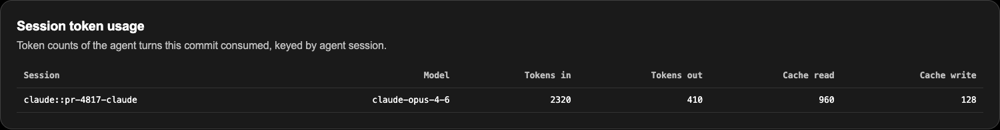

# Session token usage

git-byline can attach aggregate token usage to an attributed agent session.
It records four counts:

- input tokens;
- output tokens;
- cache-read tokens;
- cache-write tokens.

It does not record prompts, responses, prices, or a per-line token breakdown.

## View usage

For one file:

```sh
git byline blame --tokens src/example.go
```

AI lines with usage get a suffix such as:

```text
ai:claude/claude-opus-4-6 [1840i/312o/728cr/96cw]
```

For a revision range:

```sh
git byline stats HEAD~10..HEAD
git byline stats --json HEAD~10..HEAD
```

The text report adds token totals below each session when at least one count
is nonzero. JSON exposes the same fields as `tokens_in`, `tokens_out`,
`cache_read`, and `cache_write`.

The local dashboard renders a session table in commit and range reports:




## Capture and storage

Claude Code transcript usage is read from a bounded, verified transcript file.
The newest assistant turn with valid usage wins. The assistant message ID
deduplicates one turn consumed by several checkpoints. Unsupported or
unreadable usage is omitted without rejecting the checkpoint.

Usage is stored on the session record in version 4 attribution notes. It is
also present in local checkpoint state while the commit is pending. Managed
Git hooks publish `refs/notes/byline` by default. Reinstall with
`--local-notes` to keep notes local.

Interop exports and disclosure documents do not include token usage. See
[Architecture](ARCHITECTURE.md#session-token-usage) and the
[Security model](SECURITY_MODEL.md#stored-data) for format and disclosure
details.
